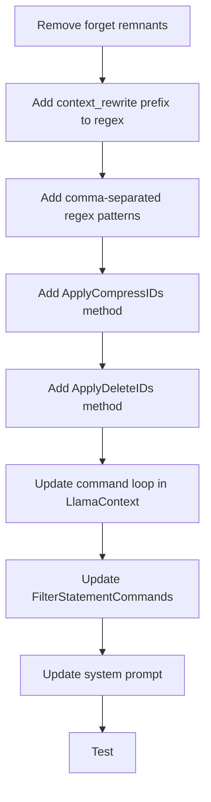

# Statement Command System — Implementation Plan

**Created:** 2026-04-24  
**Status:** Ready for Implementation  
**Related:** [`memory-compression-system-v2.md`](memory-compression-system-v2.md)

## Overview

This plan covers the complete statement command system:
1. Add `context_rewrite` mandatory prefix to all commands
2. Support comma-separated statement IDs
3. Remove obsolete `forget` command remnants

---

## Issue 1: Add `context_rewrite` Mandatory Prefix

### Problem
Instructions in [`ContextBuilder.cpp:240-244`](src/inference/ContextBuilder.cpp:240) show `context_rewrite compress S1-001` but the regex parser in [`MemoryManager.cpp:784-788`](src/inference/MemoryManager.cpp:784) only matches `compress S1-001` without the prefix. The AI needs a consistent format.

### Solution
Make `context_rewrite` a **mandatory** prefix. Update regex patterns to require it.

### Changes

#### 1a. Update regex patterns in [`ExtractStatementCommands()`](src/inference/MemoryManager.cpp:780)

**Current patterns (lines 784-788):**
```cpp
std::regex compress_range_pattern(R"(compress[ \t]+(S\d+-\d+)[ \t]+to[ \t]+(S\d+-\d+)[ \t]+with:[ \t]+(.+?))(?=\n|$)");
std::regex delete_range_pattern(R"(delete[ \t]+(S\d+-\d+)[ \t]+to[ \t]+(S\d+-\d+))(?=\n|$)");
std::regex compress_list_pattern(R"(compress[ \t]+((?:S\d+-\d+[ \t]*,[ \t]*)+S\d+-\d+)[ \t]+with:[ \t]+(.+?))(?=\n|$)");
std::regex delete_list_pattern(R"(delete[ \t]+((?:S\d+-\d+[ \t]*,[ \t]*)+S\d+-\d+))(?=\n|$)");
```

**New patterns (add `context_rewrite` prefix):**
```cpp
// Pattern 1a: context_rewrite compress S1-001 to S1-005 with: summary (range)
std::regex compress_range_pattern(R"(context_rewrite[ \t]+compress[ \t]+(S\d+-\d+)[ \t]+to[ \t]+(S\d+-\d+)[ \t]+with:[ \t]+(.+?))(?=\n|$)");

// Pattern 1b: context_rewrite compress S1-001, S1-002, S1-003 with: summary (comma-separated)
std::regex compress_list_pattern(R"(context_rewrite[ \t]+compress[ \t]+((?:S\d+-\d+[ \t]*,[ \t]*)+S\d+-\d+)[ \t]+with:[ \t]+(.+?))(?=\n|$)");

// Pattern 2a: context_rewrite delete S1-001 to S1-005 (range)
std::regex delete_range_pattern(R"(context_rewrite[ \t]+delete[ \t]+(S\d+-\d+)[ \t]+to[ \t]+(S\d+-\d+))(?=\n|$)");

// Pattern 2b: context_rewrite delete S1-001, S1-002, S1-003 (comma-separated)
std::regex delete_list_pattern(R"(context_rewrite[ \t]+delete[ \t]+((?:S\d+-\d+[ \t]*,[ \t]*)+S\d+-\d+))(?=\n|$)");
```

#### 1b. Update `FilterStatementCommands()` in [`MemoryManager.cpp:863`](src/inference/MemoryManager.cpp:863)

**Current patterns:**
```cpp
std::regex compress_range_pattern(R"(compress[ \t]+S\d+-\d+[ \t]+to[ \t]+S\d+-\d+[ \t]+with:[ \t]*[^\n]*)");
std::regex delete_range_pattern(R"(delete[ \t]+S\d+-\d+[ \t]+to[ \t]+S\d+-\d+)");
std::regex compress_list_pattern(R"(compress[ \t]+(?:S\d+-\d+[ \t]*,[ \t]*)+S\d+-\d+[ \t]+with:[ \t]*[^\n]*)");
std::regex delete_list_pattern(R"(delete[ \t]+(?:S\d+-\d+[ \t]*,[ \t]*)+S\d+-\d+)");
```

**New patterns (add `context_rewrite` prefix):**
```cpp
std::regex compress_range_pattern(R"(context_rewrite[ \t]+compress[ \t]+S\d+-\d+[ \t]+to[ \t]+S\d+-\d+[ \t]+with:[ \t]*[^\n]*)");
std::regex delete_range_pattern(R"(context_rewrite[ \t]+delete[ \t]+S\d+-\d+[ \t]+to[ \t]+S\d+-\d+)");
std::regex compress_list_pattern(R"(context_rewrite[ \t]+compress[ \t]+(?:S\d+-\d+[ \t]*,[ \t]*)+S\d+-\d+[ \t]+with:[ \t]*[^\n]*)");
std::regex delete_list_pattern(R"(context_rewrite[ \t]+delete[ \t]+(?:S\d+-\d+[ \t]*,[ \t]*)+S\d+-\d+)");
```

#### 1c. Update instructions in [`ContextBuilder.cpp:238-244`](src/inference/ContextBuilder.cpp:238)

**Current (lines 239-244):**
```cpp
ss << "**Compress** (summarize statements):\n";
ss << "- `context_rewrite compress S1-001 to S1-005 with: summary text`\n";
ss << "- `context_rewrite compress S1-001, S1-002, S1-003 with: summary text`\n\n";
ss << "**Delete** (remove statements):\n";
ss << "- `context_rewrite delete S1-001 to S1-003`\n";
ss << "- `context_rewrite delete S1-001, S1-002, S1-003`\n\n";
```

These are already correct — they show `context_rewrite` prefix. No change needed here.

---

## Issue 2: Remove `forget` Command Remnants

### Problem
The `forget` command was supposed to be removed but traces remain in 7 locations:

| Location | Content |
|----------|---------|
| [`LlamaContext.cpp:19`](src/inference/LlamaContext.cpp:19) | System prompt mentions `forget 2026-04-24 14:00:00` |
| [`MemoryManager.cpp:694-708`](src/inference/MemoryManager.cpp:694) | `ApplyForgetCommand` implementation |
| [`MemoryManager.hpp:113`](include/inference/MemoryManager.hpp:113) | `ApplyForgetCommand` declaration |
| [`MemoryManager.hpp:26`](include/inference/MemoryManager.hpp:26) | `forget_before` field in `ReplaceCommand` |
| [`MemoryManager.hpp:28`](include/inference/MemoryManager.hpp:28) | `is_forget` field in `ReplaceCommand` |
| [`LlamaContext.cpp:229-231`](src/inference/LlamaContext.cpp:229) | Command loop handles `is_forget` |
| [`LlamaContext.cpp:256`](src/inference/LlamaContext.cpp:256) | `cmd_desc` for forget |
| [`MemoryManager.cpp:817,828,845,856`](src/inference/MemoryManager.cpp:817) | `is_forget = false` assignments |

### Solution: Remove all traces

#### 2a. Update system prompt in [`LlamaContext.cpp:12-28`](src/inference/LlamaContext.cpp:12)

**Current (lines 15-19):**
```cpp
1. Compress statements: compress S1-001 to S1-005 with: summary of the compressed content
   or compress S1-001, S1-002, S1-003 with: summary of the compressed content
2. Delete statements: delete S1-001 to S1-003
   or delete S1-001, S1-002, S1-003
3. Forget by timestamp: forget 2026-04-24 14:00:00
```

**New:**
```cpp
1. Compress statements: context_rewrite compress S1-001 to S1-005 with: summary of the compressed content
   or context_rewrite compress S1-001, S1-002, S1-003 with: summary of the compressed content
2. Delete statements: context_rewrite delete S1-001 to S1-003
   or context_rewrite delete S1-001, S1-002, S1-003
```

Remove line 19 (`3. Forget by timestamp...`) and update lines 15-18 to include `context_rewrite` prefix.

#### 2b. Remove `ApplyForgetCommand` declaration in [`MemoryManager.hpp:113`](include/inference/MemoryManager.hpp:113)

**Remove line:**
```cpp
bool ApplyForgetCommand(const std::string& before_timestamp);
```

#### 2c. Remove `ApplyForgetCommand` implementation in [`MemoryManager.cpp:694-708`](src/inference/MemoryManager.cpp:694)

**Remove entire function (lines 694-708):**
```cpp
bool MemoryManager::ApplyForgetCommand(const std::string& before_timestamp) {
    auto it = std::remove_if(m_statements.begin(), m_statements.end(),
        [&before_timestamp](const Statement& stmt) {
            return stmt.timestamp < before_timestamp;
        });
    
    if (it == m_statements.begin()) return false;
    int32_t deleted_count = static_cast<int32_t>(m_statements.end() - it);
    m_statements.erase(it, m_statements.end());
    std::cout << "[MEMORY] Forgot statements before " << before_timestamp << " ("
              << deleted_count << " statements removed)." << std::endl;
    return true;
}
```

#### 2d. Remove `forget_before` and `is_forget` fields from [`ReplaceCommand`](include/inference/MemoryManager.hpp:21)

**Current struct (lines 21-29):**
```cpp
struct ReplaceCommand {
    std::vector<std::string> statement_ids;
    std::string start_id;
    std::string end_id;
    std::string summary;
    std::string forget_before;              // REMOVE
    bool is_delete;
    bool is_forget;                         // REMOVE
};
```

**New struct:**
```cpp
struct ReplaceCommand {
    std::vector<std::string> statement_ids;
    std::string start_id;
    std::string end_id;
    std::string summary;
    bool is_delete;
};
```

#### 2e. Update command loop in [`LlamaContext.cpp:226-257`](src/inference/LlamaContext.cpp:226)

**Current (lines 226-257):**
```cpp
for (const auto& cmd : commands) {
    bool success = false;
    if (cmd.is_forget) {
        success = m_memory_mgr ? m_memory_mgr->ApplyForgetCommand(cmd.forget_before) : false;
    }
    else if (!cmd.statement_ids.empty()) { ... }
    else if (cmd.is_delete) { ... }
    else if (!cmd.summary.empty()) { ... }
    
    std::string cmd_desc;
    if (!cmd.statement_ids.empty()) { ... }
    else { ... }
    if (cmd.is_forget) cmd_desc = "forget " + cmd.forget_before;
    InjectReportStatement(m_memory_mgr, cmd_desc, success);
}
```

**New:**
```cpp
for (const auto& cmd : commands) {
    bool success = false;
    if (!cmd.statement_ids.empty()) {
        if (cmd.is_delete) {
            success = m_memory_mgr ? m_memory_mgr->ApplyDeleteIDs(cmd.statement_ids) : false;
        }
        else if (!cmd.summary.empty()) {
            success = m_memory_mgr ? m_memory_mgr->ApplyCompressIDs(cmd.statement_ids, cmd.summary) : false;
        }
    }
    else if (cmd.is_delete) {
        success = m_memory_mgr ? m_memory_mgr->ApplyDeleteCommand(cmd.start_id, cmd.end_id) : false;
    }
    else if (!cmd.summary.empty()) {
        success = m_memory_mgr ? m_memory_mgr->ApplyCompressCommand(cmd.start_id, cmd.end_id, cmd.summary) : false;
    }
    
    std::string cmd_desc;
    if (!cmd.statement_ids.empty()) {
        cmd_desc = (cmd.is_delete ? "delete " : "compress ") + cmd.statement_ids[0];
        for (size_t i = 1; i < cmd.statement_ids.size(); ++i) {
            cmd_desc += ", " + cmd.statement_ids[i];
        }
    } else {
        cmd_desc = (cmd.is_delete ? "delete " : "compress ") + cmd.start_id + " to " + cmd.end_id;
    }
    InjectReportStatement(m_memory_mgr, cmd_desc, success);
}
```

#### 2f. Remove `is_forget = false` assignments in [`ExtractStatementCommands()`](src/inference/MemoryManager.cpp:780)

Remove all `cmd.is_forget = false;` lines (currently at lines 817, 828, 845, 856).

---

## Issue 3: Comma-Separated Statement IDs (Existing Plan)

### What Works
- Range format: `context_rewrite compress S1-001 to S1-005 with: summary`
- Range format: `context_rewrite delete S1-001 to S1-005`

### What Is Missing
- Comma-separated format: `context_rewrite compress S1-001, S1-002, S1-003 with: summary`
- Comma-separated format: `context_rewrite delete S1-001, S1-002, S1-003`

### Implementation Steps

#### Step 1: Update Regex Patterns in `ExtractStatementCommands()`

**File:** [`src/inference/MemoryManager.cpp`](src/inference/MemoryManager.cpp:780)

See **Issue 1, Step 1a** above for the updated patterns (already include `context_rewrite` prefix).

**Parsing logic:**
After regex match, if the captured group contains commas, split by comma and populate `statement_ids`. Otherwise, populate `start_id`/`end_id` as before.

```cpp
// Helper lambda to split comma-separated IDs
auto splitIDs = [](const std::string& ids_str) -> std::vector<std::string> {
    std::vector<std::string> result;
    std::istringstream stream(ids_str);
    std::string id;
    while (std::getline(stream, id, ',')) {
        size_t start = id.find_first_not_of(" \t");
        size_t end = id.find_last_not_of(" \t");
        if (start != std::string::npos && end != std::string::npos) {
            result.push_back(id.substr(start, end - start + 1));
        }
    }
    return result;
};

// For compress_list_pattern match:
auto begin = std::sregex_iterator(text.begin(), text.end(), compress_list_pattern);
auto end = std::sregex_iterator();
for (auto it = begin; it != end; ++it) {
    ReplaceCommand cmd;
    std::string ids_str = (*it)[1].str();
    if (ids_str.find(',') != std::string::npos) {
        cmd.statement_ids = splitIDs(ids_str);
    } else {
        cmd.start_id = (*it)[1].str();
        cmd.end_id = (*it)[2].str();
    }
    cmd.summary = (*it)[2].str(); // or [3] if using different group numbering
    cmd.is_delete = false;
    commands.push_back(cmd);
}
```

#### Step 2: Add `ApplyCompressIDs()` Method

**File:** [`include/inference/MemoryManager.hpp`](include/inference/MemoryManager.hpp:114)  
**Add declaration:**
```cpp
bool ApplyCompressIDs(const std::vector<std::string>& ids, const std::string& summary);
```

**File:** [`src/inference/MemoryManager.cpp`](src/inference/MemoryManager.cpp:710)  
**Add implementation:**
```cpp
bool MemoryManager::ApplyCompressIDs(const std::vector<std::string>& ids, const std::string& summary) {
    if (ids.empty()) return false;
    
    std::vector<int32_t> indices;
    for (const auto& id : ids) {
        int32_t idx = FindStatementByID(id);
        if (idx < 0) {
            std::cerr << "[MEMORY] Compress failed: statement " << id << " not found" << std::endl;
            return false;
        }
        indices.push_back(idx);
    }
    
    std::sort(indices.begin(), indices.end());
    indices.erase(std::unique(indices.begin(), indices.end()), indices.end());
    
    int32_t original_tokens = 0;
    for (int32_t idx : indices) {
        original_tokens += CountTokensInternal(m_statements[idx].content);
    }
    
    Statement new_stmt;
    new_stmt.id = GenerateStatementID();
    new_stmt.timestamp = m_current_timestamp.empty() ? GetCurrentTimestamp() : m_current_timestamp;
    new_stmt.type = "SUMMARY";
    new_stmt.content = summary;
    
    for (int32_t i = static_cast<int32_t>(indices.size()) - 1; i >= 0; --i) {
        m_statements.erase(m_statements.begin() + indices[i]);
    }
    m_statements.insert(m_statements.begin() + indices.front(), new_stmt);
    
    std::cout << "[MEMORY] Compressed " << indices.size() << " statements (";
    for (size_t i = 0; i < ids.size(); ++i) {
        if (i > 0) std::cout << ", ";
        std::cout << ids[i];
    }
    std::cout << "). Saved ~" << original_tokens << " tokens." << std::endl;
    return true;
}
```

#### Step 3: Add `ApplyDeleteIDs()` Method

**File:** [`include/inference/MemoryManager.hpp`](include/inference/MemoryManager.hpp:115)  
**Add declaration:**
```cpp
bool ApplyDeleteIDs(const std::vector<std::string>& ids);
```

**File:** [`src/inference/MemoryManager.cpp`](src/inference/MemoryManager.cpp:745)  
**Add implementation:**
```cpp
bool MemoryManager::ApplyDeleteIDs(const std::vector<std::string>& ids) {
    if (ids.empty()) return false;
    
    std::vector<int32_t> indices;
    for (const auto& id : ids) {
        int32_t idx = FindStatementByID(id);
        if (idx < 0) {
            std::cerr << "[MEMORY] Delete failed: statement " << id << " not found" << std::endl;
            return false;
        }
        indices.push_back(idx);
    }
    
    std::sort(indices.begin(), indices.end());
    indices.erase(std::unique(indices.begin(), indices.end()), indices.end());
    
    for (int32_t i = static_cast<int32_t>(indices.size()) - 1; i >= 0; --i) {
        m_statements.erase(m_statements.begin() + indices[i]);
    }
    
    std::cout << "[MEMORY] Deleted " << indices.size() << " statements (";
    for (size_t i = 0; i < ids.size(); ++i) {
        if (i > 0) std::cout << ", ";
        std::cout << ids[i];
    }
    std::cout << ")." << std::endl;
    return true;
}
```

#### Step 4: Update `FilterStatementCommands()` to Remove Comma-Separated Patterns

**File:** [`src/inference/MemoryManager.cpp`](src/inference/MemoryManager.cpp:863)

See **Issue 1, Step 1b** above for the updated patterns (already include `context_rewrite` prefix).

---

## File Changes Summary

| File | Changes |
|------|---------|
| [`include/inference/MemoryManager.hpp`](include/inference/MemoryManager.hpp) | Remove `forget_before` and `is_forget` from `ReplaceCommand`; remove `ApplyForgetCommand` declaration; add `ApplyCompressIDs()` and `ApplyDeleteIDs()` declarations |
| [`src/inference/MemoryManager.cpp`](src/inference/MemoryManager.cpp) | Update regex patterns with `context_rewrite` prefix; remove `ApplyForgetCommand`; add `ApplyCompressIDs()`, `ApplyDeleteIDs()`; update `FilterStatementCommands()` |
| [`src/inference/LlamaContext.cpp`](src/inference/LlamaContext.cpp) | Update system prompt (remove forget, add `context_rewrite` prefix); remove `is_forget` handling from command loop |
| [`src/inference/ContextBuilder.cpp`](src/inference/ContextBuilder.cpp) | Verify instructions show `context_rewrite` prefix (already correct at lines 240-244) |

---

## Execution Order



## Testing Checklist

- [ ] Test `context_rewrite compress S1-001 to S1-005 with: summary` (range)
- [ ] Test `context_rewrite compress S1-001, S1-002, S1-003 with: summary` (comma-separated)
- [ ] Test `context_rewrite delete S1-001 to S1-005` (range)
- [ ] Test `context_rewrite delete S1-001, S1-002, S1-003` (comma-separated)
- [ ] Test mixed order IDs (e.g., `context_rewrite compress S1-003, S1-001, S1-002 with: summary`)
- [ ] Test single ID (e.g., `context_rewrite compress S1-001 with: summary`)
- [ ] Test error handling for non-existent statement IDs
- [ ] Verify tool report shows correct comma-separated IDs
- [ ] Verify clean response filters out all command patterns
- [ ] Verify `forget` command is no longer recognized or documented
